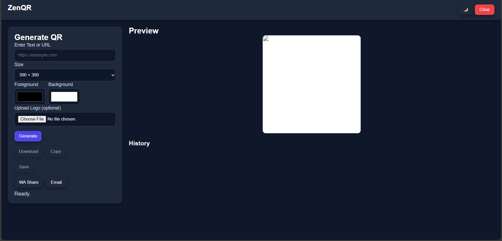
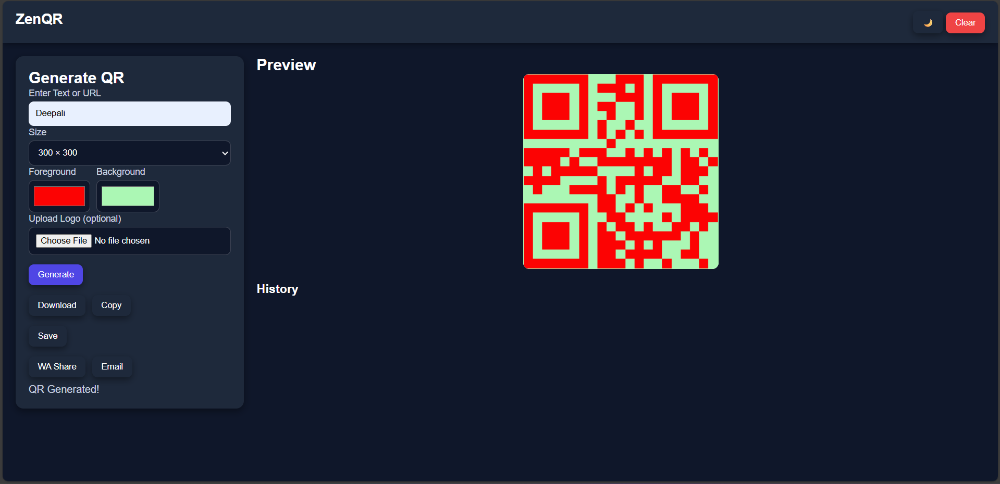
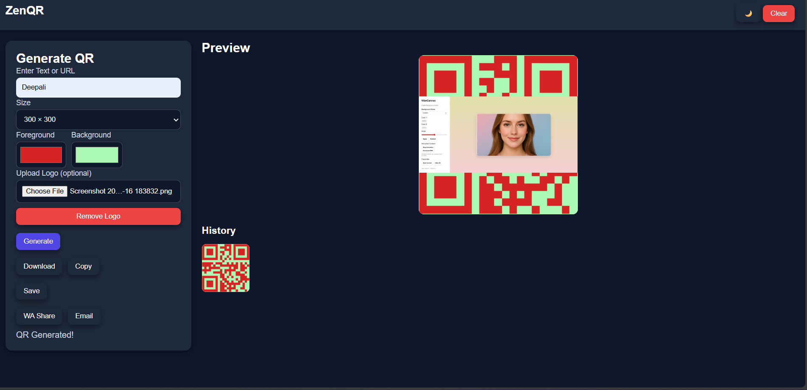
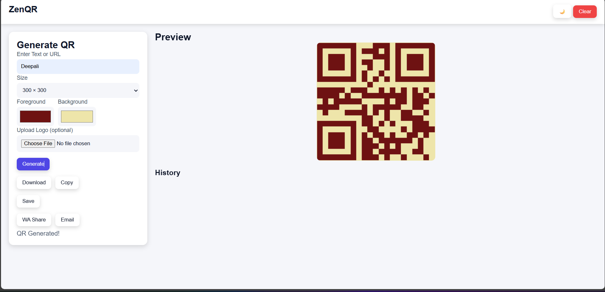
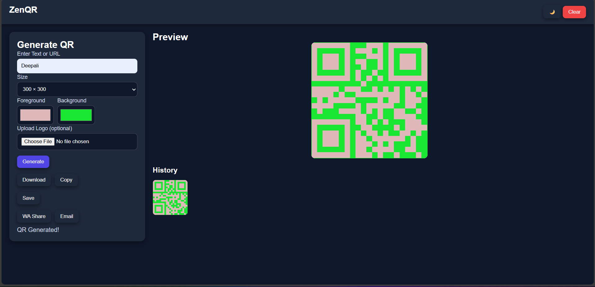

# 🌟 ZenQR – Advanced QR Code Generator

**ZenQR** is a modern, customizable, and powerful QR code generator built using **HTML, CSS, and JavaScript** with **qr-code-styling v1.5.0**.  
It supports logo embedding, color customization, high-resolution export, history saving, theme switching, and more — all client-side with no external APIs.

---

## 🚀 Live Demo  
👉 *(Enable GitHub Pages to make this live link work)*  
https://deepali-kumari-iitp.github.io/ZenQR/

---

## ✨ Features

### 🎨 Custom QR Generation  
- Add URL or any text  
- Choose QR size (150 → 800px)  
- Customize foreground & background colors  

### 🖼️ Logo Support  
- Upload a logo  
- Logo appears directly inside final PNG  
- Remove-logo button included  

### 📥 Export Options  
- Download high-resolution PNG  
- Copy QR image to clipboard  

### 🕒 History (Auto Save)  
- Saves up to 30 recent QR codes  
- Includes logo, colors, size, and text  
- Data stored in browser's LocalStorage  
- One-click restore  

### 🌓 Theme Mode  
- Light mode  
- Dark mode  
- Smooth transition  

### 📱 Responsive UI  
- Works on mobile  
- Tablet compatible  
- Desktop optimized  

---

## 📸 Screenshots

### 🔹 Main Interface  

### 🔹 QR Generated  

### 🔹 QR With Logo  

### 🔹 Light Mode  

### 🔹 Dark Mode  

### 🔹 History Section  

---

## 📂 Project Structure

ZenQR/
│── index.html
│
├── css/
│ └── style.css
│
├── js/
│ └── main.js
│
├── asset/
│ └── sspic/
│ ├── preview.png
│ ├── qr-generated.png
│ ├── qr-with-logo.png
│ ├── lightMode.png
│ ├── darkMode.png
│ └── history.png
│
└── README.md

---

## ▶️ How to Use

1. Type or paste any URL/text  
2. Select QR size  
3. Choose foreground & background color  
4. Upload logo *(optional)*  
5. Click **Generate**  
6. Download or Copy the QR  
7. Save it to History  
8. Restore old QRs anytime  

---

## 🔧 Technologies Used

| Component | Technology |
|----------|------------|
| Frontend | HTML, CSS, JavaScript |
| QR Engine | qr-code-styling v1.5.0 |
| Storage | LocalStorage |
| UI | Responsive Web Design |

---

## 🔮 Future Enhancements

- Gradient QR styles  
- Different dot shapes  
- Export as SVG / PDF  
- Share QR image directly to social apps  
- Bulk QR creation (CSV import)  
- AI-generated QR color suggestions  
- PWA support (Installable app)  

*(All are practical, high-quality upgrades for next versions.)*

---

## ⚠ Known Limitations

- WhatsApp doesn’t allow image sharing directly via JavaScript (only text).  
- Clipboard-image copying may not work on older browsers—use “Download” instead.  

---

## 👩‍💻 Author

**Deepali Kumari**  
_IIT Patna – Computer Science & Data Analytics_  
Web Developer • Tech Explorer • Designer  

---

## ⭐ Support

If you like this project, please consider giving it a ⭐ on GitHub!

